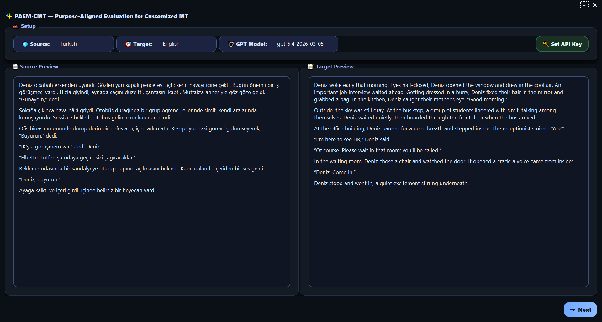
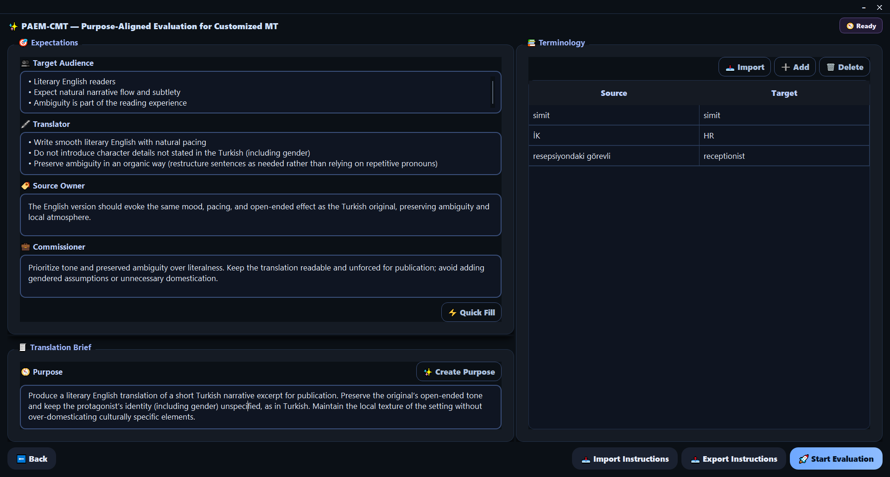
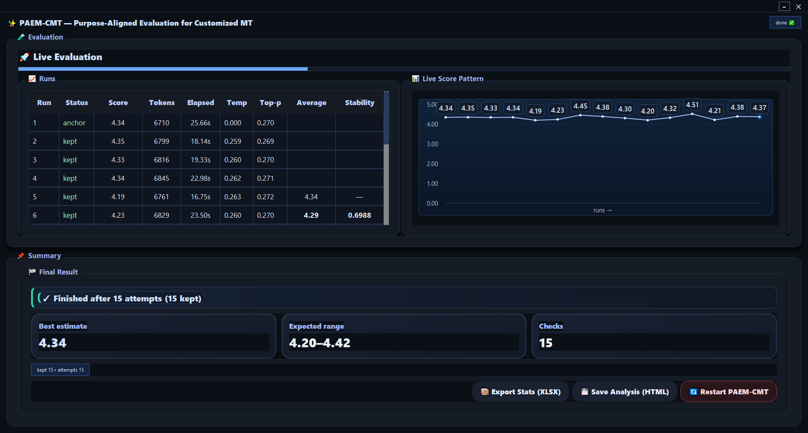

# PAEM-CMT: Purpose-Aligned Evaluation Metric for Customized Machine Translation

PAEM-CMT is a reference-free, LLM-as-a-judge metric and desktop application for evaluating machine translation against an explicit translation brief.

MT evaluation becomes difficult when the same source text can be translated fluently in different ways for different purposes. PAEM-CMT is built for that situation. It asks whether a translation is adequate for the job it was given, not whether it is merely fluent or close to a single assumed reference.

## Use PAEM-CMT

There are two ways to use PAEM-CMT:

- **Windows app:** download the packaged executable from the [latest release](https://github.com/pasabayramoglu/paem-cmt/releases/latest) and run it directly. You do not need to install Python for this version.
- **Source version:** run the Python source code locally if you want to inspect or modify the tool.

If you only want to use PAEM-CMT, the Windows app is the easiest option.

## Interface preview

### 1. Setup and document preview



Load the source document and translation, set the source and target languages, and confirm the model before moving to the brief.

### 2. Brief and terminology setup



Define the purpose, audience, stakeholder expectations, and terminology requirements that the translation will be evaluated against.

### 3. Evaluation results



Review the repeated evaluation runs, live score pattern, best estimate, expected range, and export options for HTML and XLSX output.

## What PAEM-CMT evaluates

PAEM-CMT takes three core inputs:

- the source text
- the translation
- a structured translation brief

The brief is the evaluation target. It is not treated as optional background context.

The tool evaluates the translation through six fixed dimensions:

- Intended Purpose
- Target Audience
- Translator
- Source Owner
- Commissioner
- Terminology Adherence

These dimensions are used together so that the evaluation stays tied to the actual task conditions rather than drifting into generic quality judgments.

## Model backend

The current version uses the OpenAI GPT-5 family through the API.

The default evaluation model in this version is:

`gpt-5.4-2026-03-05`

## How scoring works

PAEM-CMT uses deductive scoring on a `0.00–5.00` scale.

A single evaluation starts from `5.00` and subtracts evidence-based deductions for defects. It does not add bonus points for strengths. Defects are assigned to the most relevant evaluation dimension, overlapping problems are merged, and repeated problems can be escalated when they reflect the same underlying brief failure rather than separate minor issues. When a translation shows major or critical failures against the brief, evidence-based ceilings prevent the score from remaining artificially high.

The tool does not stop at one number. It also produces a structured explanation of how that score was reached. The output includes:

- dimension scores
- subtotal scores
- an overall score
- weaknesses linked to quoted evidence
- strengths linked to quoted evidence
- short actionable suggestions
- a best estimate
- an expected range across the kept evaluation runs

The goal is not only to score the translation, but to make the reasoning checkable.

## Reliability, hallucinations, and repeated evaluation

PAEM-CMT does not rely on a single LLM judgment.

It begins with a deterministic anchor evaluation at `temperature 0`, then repeats the evaluation under controlled settings so that instability becomes visible instead of being ignored.

This matters because LLM-as-a-judge systems can drift, overstate, or hallucinate. PAEM-CMT deals with that directly.

Its reliability logic includes:

- a deterministic first evaluation
- controlled repeated evaluations
- evidence-linked reporting based on quoted snippets
- audit checks for unsupported or missing quoted evidence
- filtering or discarding runs that fail the audit
- stopping criteria
- best-estimate and expected-range reporting

In practical terms, PAEM-CMT does not treat every run as equally trustworthy. If a run contains unsupported evidence, missing quoted support, or other audit failures, that run can be flagged and excluded from the retained result set.

The final result therefore reports two things:

- **best estimate:** the central score for the translation
- **expected range:** the range within which the retained evaluations actually held

This does not eliminate LLM instability, but it makes instability and hallucination risk visible and manageable instead of hiding them behind a single pass.

## Terminology handling

Terminology is treated as a brief-based requirement in context, not as simple word matching.

Required terms create source-side obligations. PAEM-CMT checks whether the required target term family is used where needed, whether obligations are missed, and whether competing alternatives undermine the brief. A term can still count as fulfilled under restructuring when the wording changes but the obligation remains satisfied.

This matters because a translation can sound fluent while still violating task-critical terminology requirements.

## Desktop workflow

The current desktop app follows this workflow:

1. Load the source document for local preview.
2. Define the brief: purpose, target audience, translator expectations, source-owner expectations, commissioner expectations, and terminology.
3. Optionally use the built-in drafting helpers for selected brief fields.
4. Load the translation.
5. Run repeated PAEM-CMT evaluation.
6. Review the live run status, best estimate, expected range, and evidence-linked report.
7. Export the results as HTML and XLSX output.

## Output files

PAEM-CMT produces two main output files.

### HTML report

The HTML report is the main reader-friendly output. It is designed for direct review and sharing. It presents the overall result, the profile across the six dimensions, quoted strengths and weaknesses, terminology findings, the best estimate, and the expected range.

Use the HTML report when you want a readable evaluation report.

### XLSX workbook

The XLSX workbook is the technical companion output. It is meant for closer inspection of the evaluation process and audit trail.

In the current version, the workbook includes technical and audit-oriented sheets such as:

- `Terminology_Audit`
- `Stability_Audit`
- `Stability_Path`

Use the XLSX workbook when you want to inspect run history, stability handling, and detailed terminology audit material.

## Privacy and local handling

Document loading, parsing, previewing, and report generation run locally.

Network access is used only for OpenAI-backed features.

The API key is kept in memory for the current session and is not written to disk by the app. When the app is closed, that session key is gone. The app also lets you clear the current session and optionally clear the API key before restarting.

## Input structure

PAEM-CMT expects:

- a source text
- a translation
- source and target language information
- a brief with:
  - purpose
  - target audience
  - translator expectations
  - source-owner expectations
  - commissioner expectations
- optional terminology pairs

The app also supports importing and exporting the brief and terminology setup as JSON.

## Quick start

### Option 1: Windows app

Download the latest Windows build from the [latest release](https://github.com/pasabayramoglu/paem-cmt/releases/latest).

Unzip the downloaded file, open the `PAEM-CMT` folder, and run `PAEM-CMT.exe`.

If Windows shows a warning for an unsigned app, use the normal **More info → Run anyway** path if you trust the release source.

### Option 2: Run from source

#### Requirements

- Python 3.11 or newer
- OpenAI API access
- a valid OpenAI API key

#### Install

```bash
git clone https://github.com/pasabayramoglu/paem-cmt.git
cd paem-cmt
pip install -r requirements.txt
```

#### Run

```bash
python paem-cmt.py
```

When the app starts, enter your OpenAI API key for the current session.

## Dependencies

The current source version depends on:

- PyQt5
- openai
- python-docx
- mammoth
- Markdown
- beautifulsoup4
- chardet
- colorama
- openpyxl

## Scope and limitations

PAEM-CMT is best suited to evaluation settings where purpose, audience, stakeholder expectations, and terminology matter enough to justify explicit brief-conditioned evaluation.

It also has clear trade-offs:

- it is more expensive than single-pass evaluation because it uses repeated LLM-based evaluation
- longer texts can create added difficulty for prompt length, evidence selection, and stability behavior

## License

This project is released under the MIT License. See the `LICENSE` file for the full text.

## Author

Paşa Abdullah Bayramoğlu  
Üsküdar University / İstanbul  
pasa.bayramoglu@uskudar.edu.tr
